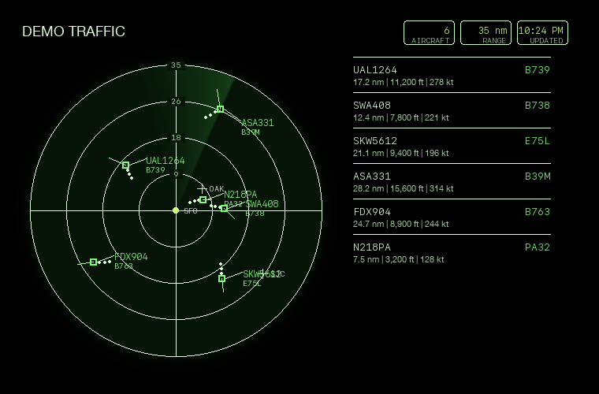
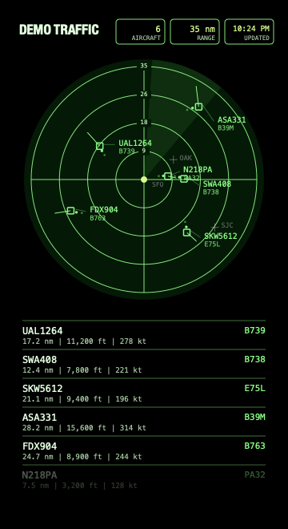
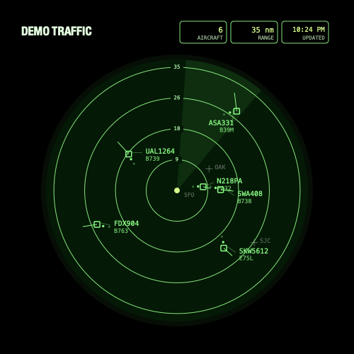

# MMM-ADSB-Radar

A MagicMirror module for a [Tiny Desk Radar](https://www.gadgies.co.uk/)-style ADS-B viewer. Initially built for use with Flightradar24's Pi24 project to view the live data your receiver is sending. This module can also use live traffic data from Airplanes.live.

The default view is a demo radar centered on the San Francisco Bay Area with SFO, OAK, and SJC airports shown.

## Screenshots

### Radar With List



### Sidebar With List



### Radar Only



## Installation

Install into your MagicMirror `modules` directory.

```bash
cd ~/MagicMirror/modules
git clone https://github.com/sakowitz/MMM-ADSB-Radar.git
```

## Update

```bash
cd ~/MagicMirror/modules/MMM-ADSB-Radar
git pull
```

If you use the optional local aircraft database, you can refresh it after updating:

```bash
npm run build:aircraft-db
```

## Configuration

Add MMM-ADSB-Radar module to the modules array in the config/config.js file.

The module demos automatically when no receiver URL is set. Airplanes.live can be used as the primary source or as a fallback when your local receiver is empty or unavailable. See the [Airplanes.live REST API guide](https://airplanes.live/api-guide/) and [API tier page](https://airplanes.live/api/) for current limits and terms.

Online-only example:

```js
{
  module: "MMM-ADSB-Radar",
  position: "top_right",
  config: {
    source: "online",
    onlineProvider: "airplanesLive",
    centerLat: 37.6213,
    centerLon: -122.379,
    rangeNm: 35,
    fetchInterval: 180000,
    demoMode: false,
    mode: "hybrid"
  }
}
```

## Local Receiver Example

Use this for Pi24, dump1090, readsb, tar1090, or graphs1090 JSON feeds.

```js
{
  module: "MMM-ADSB-Radar",
  position: "top_right",
  config: {
    source: "receiver",
    receiverUrl: "http://your-receiver.local:8754/flights.json",
    centerLat: 37.6213,
    centerLon: -122.379,
    rangeNm: 35,
    demoMode: false,
    mode: "hybrid"
  }
}
```

Common local feed URLs:

```text
http://pi24.local:8754/flights.json
http://raspberrypi.local:8754/flights.json
http://raspberrypi.local/data/aircraft.json
http://raspberrypi.local:8888/data/aircraft.json
http://adsbexchange.local/tar1090/data/aircraft.json
http://readsb.local/tar1090/data/aircraft.json
```

For Pi24, the web settings page is usually available at:

```text
http://pi24.local:8754/settings.html
```

To enable a dump1090-style HTTP feed in Pi24, add this to the dump1090 process arguments:

```text
--net --net-http-port 8888
```

Receiver-first with Airplanes.live fallback:

```js
{
  module: "MMM-ADSB-Radar",
  position: "top_right",
  config: {
    source: "auto",
    receiverUrl: "http://your-receiver.local:8754/flights.json",
    onlineProvider: "airplanesLive",
    centerLat: 37.6213,
    centerLon: -122.379,
    rangeNm: 35,
    fetchInterval: 15000,
    demoMode: false,
    mode: "hybrid"
  }
}
```

The module uses Airplanes.live's point endpoint:

```text
https://api.airplanes.live/v2/point/{lat}/{lon}/{radius}
```

The module fills in `{lat}`, `{lon}`, and `{radius}` from your radar center and range. Radius is capped at 250 nautical miles.

`fetchInterval` is used for every source, including Pi24/local receiver feeds and Airplanes.live. The default is 15000 ms, which is a good local-receiver refresh rate. Their API tier page lists a free pull limit of 500 requests/day; if you run online-only mode all day on the free tier, use 180000 ms or higher.

## Local Aircraft Type Database

Pi24's `flights.json` usually includes callsign and hex code, but often does not include aircraft type. The module can enrich local receiver data from a compact local lookup database generated from OpenSky's aircraft metadata CSV. 15-30 MB of local disk space is needed for the optional aircraft type database.

Build the database inside the module folder:

```bash
cd ~/MagicMirror/modules/MMM-ADSB-Radar
npm run build:aircraft-db
```

This creates ignored local files in `aircraft-db/`.

The generated database maps aircraft hex codes to ICAO type codes and registrations. It is intentionally not committed to GitHub, so regular `git pull` stays small. Re-run the build command whenever you want to refresh the lookup data.

If you already downloaded OpenSky's CSV manually, build from that file instead:

```bash
node scripts/build-aircraft-db.js --source /path/to/aircraftDatabase.csv
```

## Options

| Option | Default | Description |
| --- | --- | --- |
| `source` | `"receiver"` | Data source mode. Use `"receiver"` for `receiverUrl`, `"online"` for Airplanes.live, or `"auto"` to try the receiver first and fall back to Airplanes.live. With the default blank `receiverUrl`, `demoMode: "auto"` starts demo traffic. |
| `receiverUrl` | `""` | URL for a Pi24 `flights.json`, dump1090/readsb/tar1090 `aircraft.json`, or JSONP `flights.js` feed. |
| `onlineProvider` | `"airplanesLive"` | Online provider. Currently supports `"airplanesLive"`. |
| `onlineUrl` / `airplanesLiveUrl` | `""` | Optional online URL template override. Supports `{lat}`, `{lon}`, `{radius}`, and `{range}` placeholders. |
| `onlineRangeNm` | `null` | Optional online query radius. Defaults to `rangeNm` and is capped at 250 nm for Airplanes.live. |
| `aircraftDbEnabled` | `true` | Use a local hex-to-aircraft lookup database when present. If the database has not been generated, the module continues without it. |
| `aircraftDbPath` | `"aircraft-db"` | Path to generated aircraft lookup chunks. Relative paths resolve inside the module folder. |
| `aircraftDbChunkLength` | `2` | Hex prefix length used for database chunk files. Match the builder's `--chunk-length` value. |
| `aircraftDbMaxCachedChunks` | `16` | Maximum aircraft DB chunks cached in memory. |
| `centerLat` | `37.6213` | Radar center latitude. Default is near SFO. |
| `centerLon` | `-122.379` | Radar center longitude. Default is near SFO. |
| `rangeNm` | `35` | Radar range in nautical miles. |
| `fetchInterval` | `15000` | Feed refresh interval in milliseconds. Used for local receivers and online sources. Use 180000 ms or higher for free tier Airplanes.live. |
| `maxSeenSeconds` | `45` | Hide aircraft whose feed-reported position age is older than this many seconds. |
| `maxAircraft` | `28` | Maximum aircraft to render. |
| `persistTracks` | `true` | Keep recently seen aircraft on screen briefly when they miss one or two feed updates. |
| `trackPersistenceMs` | `45000` | Maximum time to retain a missing aircraft target before hiding it. |
| `trackPersistenceMaxMisses` | `2` | Maximum missed feed updates to retain a target. |
| `animateAircraft` | `true` | Drift targets between feed updates using reported speed and heading. |
| `aircraftAnimationDurationMs` | `null` | Animation duration. Defaults to `fetchInterval`. |
| `aircraftAnimationMaxDistanceNm` | `3` | Maximum projected movement per animation cycle. |
| `mode` | `"hybrid"` | Display mode: `"radar"`, `"list"`, or `"hybrid"`. |
| `title` | `"ADS-B Radar"` | Module header text. |
| `radarSize` | `360` | Radar diameter in pixels. |
| `animationSpeed` | `0` | MagicMirror DOM fade speed in milliseconds. Keep at `0` to avoid blink on refresh. |
| `showLabels` | `true` | Show callsign/type labels on the scope. |
| `showStats` | `true` | Show aircraft count, range, and update time. |
| `showList` | `true` | Show the nearby aircraft list when `mode` is `"hybrid"` or `"list"`. |
| `listWidth` | `220` | Width of the side list in pixels. |
| `listMaxHeight` | `null` | Maximum side-list height. Defaults to the radar diameter. Extra rows are hidden behind a bottom fade. |
| `showRangeLabels` | `true` | Show range labels at the top of each radar ring. |
| `rangeLabelCount` | `4` | Number of labeled range rings. |
| `showTrails` | `true` | Leave short position trails behind aircraft. |
| `trailMaxPoints` | `4` | Number of previous position dots retained per aircraft. |
| `trailMaxAgeMs` | `90000` | Maximum age of aircraft trail dots. |
| `showLeaderLines` | `true` | Legacy switch for heading vectors. Set to `false` to hide them. |
| `showLabelConnectors` | `true` | Show faint connector lines from aircraft targets to labels. |
| `showHeadingVectors` | `true` | Show ATC-style heading vectors from each aircraft target. |
| `headingVectorMinPx` | `10` | Minimum heading-vector length in pixels. |
| `headingVectorMaxPx` | `46` | Maximum heading-vector length in pixels. |
| `headingVectorKtPerPixel` | `12` | Speed scaling for heading vectors. Lower numbers make longer vectors. |
| `showAirports` | `true` | Show configured airport markers on the radar scope. |
| `airports` | SFO/OAK/SJC | Airports to plot as `{ code, name, lat, lon }`. Set to `[]` to hide default airport markers while leaving `showAirports` available. |
| `demoMode` | `"auto"` | `true` forces demo traffic, `false` forces live/online data, and `"auto"` demos only when `receiverUrl` is blank. |
| `units` | `"imperial"` | Use `"metric"` for km, meters, and km/h. |
| `minAltitudeFt` | `null` | Optional minimum altitude filter in feet. |
| `maxAltitudeFt` | `null` | Optional maximum altitude filter in feet. |
| `colors` | object | Override scope, ring, sweep, aircraft, stale-aircraft, airport, text, muted, and accent colors. |

## Notes

- A Pi 3 can read and feed ADS-B data, but running MagicMirror and Pi24 on the same board may feel tight. If your mirror is on another device, point `receiverUrl` at the Pi24 receiver across your LAN.
- Airplanes.live's public REST API currently does not require an account or API key, but its public docs say feeder access could be required in the future and their published API tiers include request limits.
- The local aircraft database is best-effort metadata. Some military, blocked, temporary, or recently changed aircraft may still show no type.
